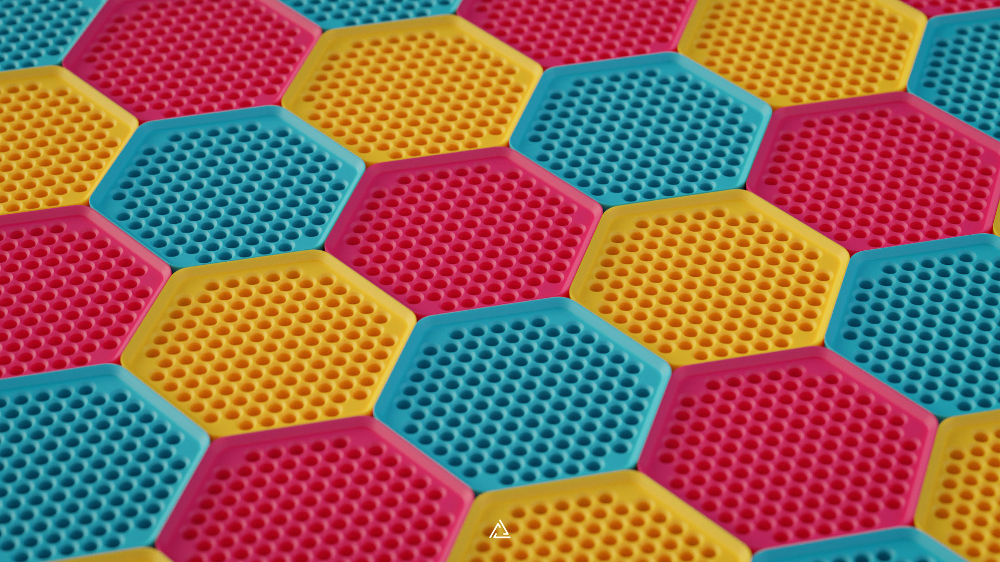
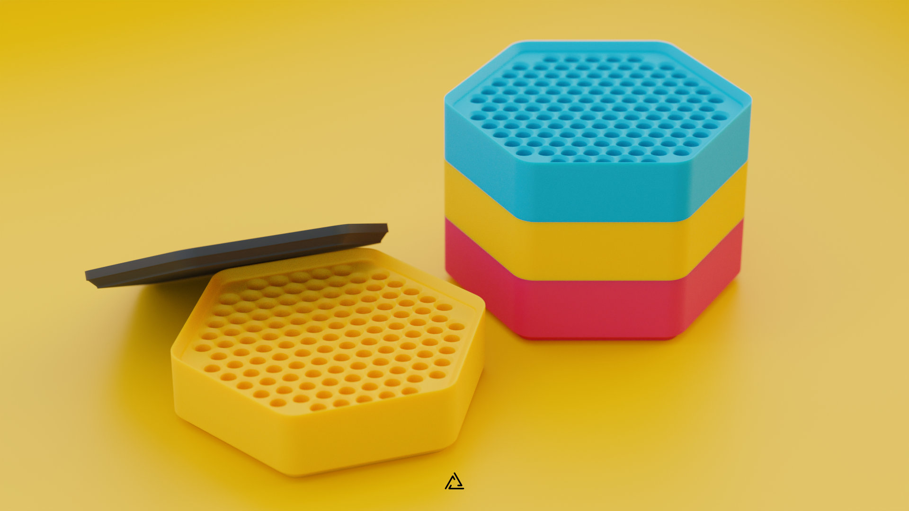

# Spring Keeper

## Introduction

The Spring Keeper is a stackable spring container with a maximum capacity of 120 switch springs.

## Making your own Spring Keeper

The reference file for the Spring Keeper are located on the [production directory](./production/).

## Acknowledgements

- [The Royal](https://github.com/The-Royal/Tools-The_Royal_Spring_Lube_Station)
- [TX Keyboards](https://www.us.txkeyboards.com/)
